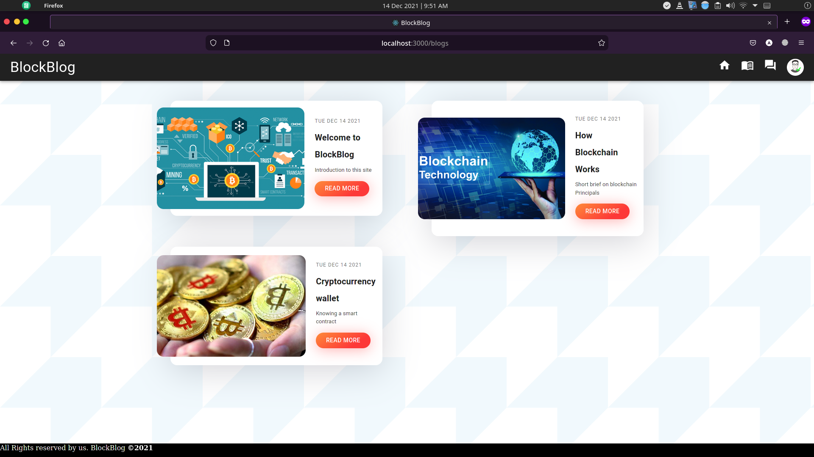
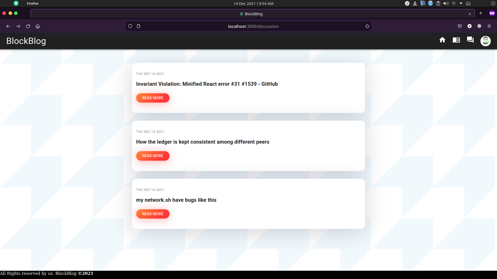
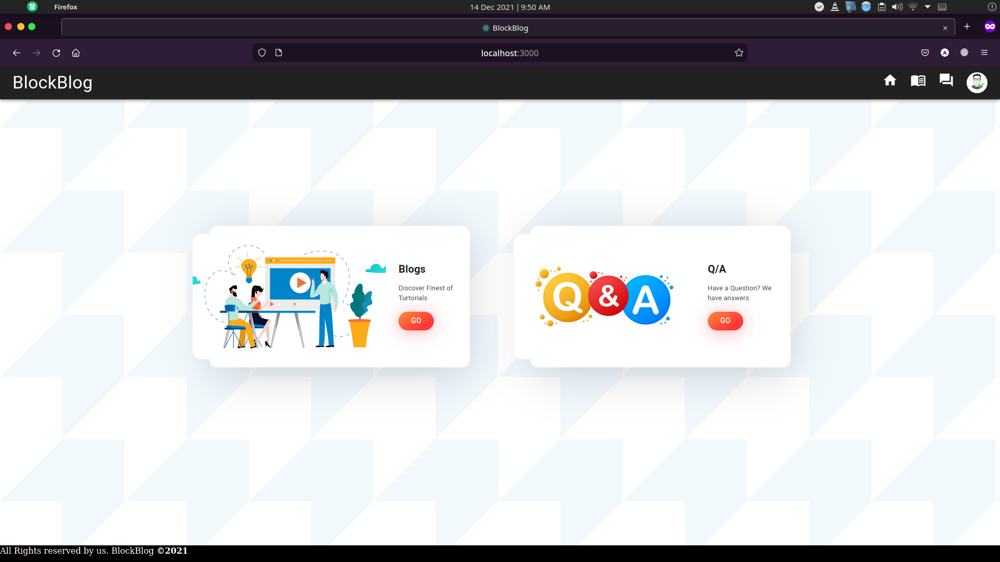
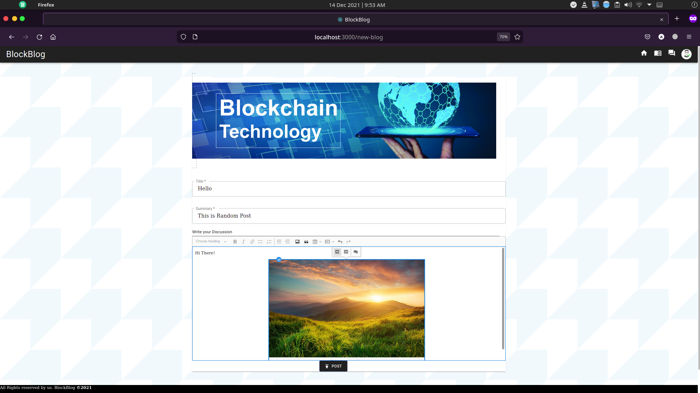
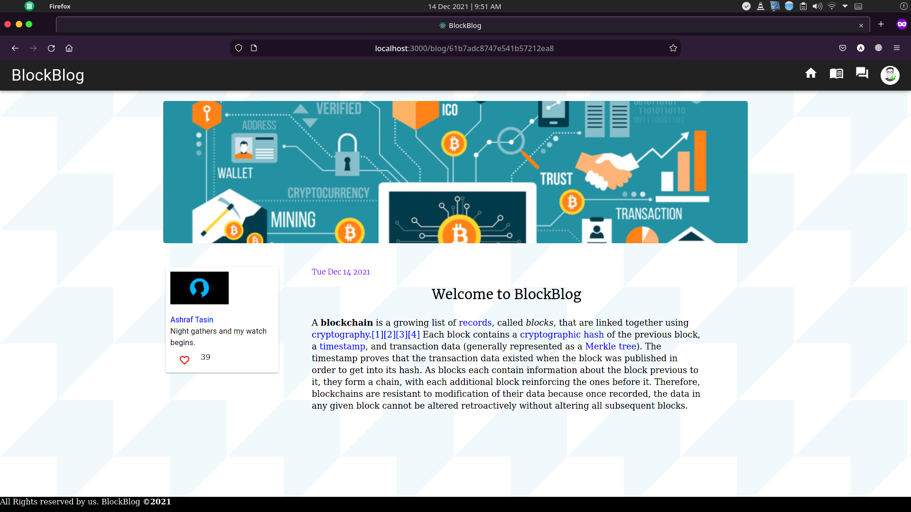
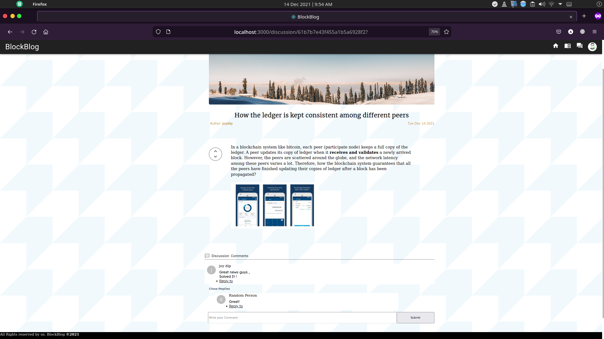
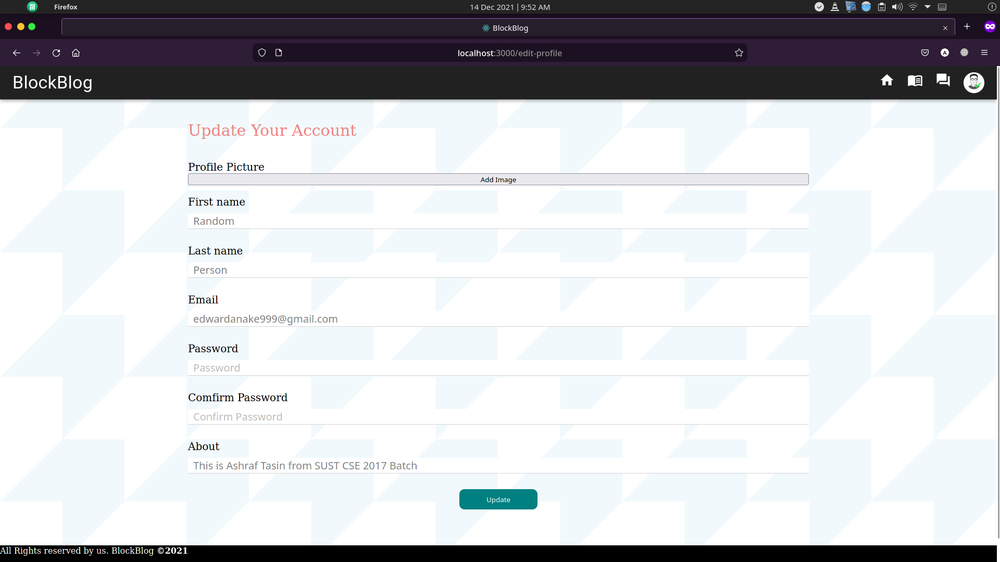

# Motivation :
This project is a part of course CSE-332 (Software Engineering Lab). Our motivation was to create a platform for blockchain enthusiastic people. As blockchain is a new technology, the resource on this topic is very difficult to find. We wanted to create a platform where people can share detailed hands-on tutorial or their ideas on various topics of blockchain. Also, when developing any blockchain application/gathering information on any particular blockchain related topic, people may find difficulties and many question may arise. So we added a Q/A sector. Basically this project is one kind of a mixture of medium and stackoverflow. Here people can share their knowledge and help each other when necessary.

# Contributors
#### 2017331014 ( Ashraf Tasin ) and  2017331064 (Joydip das)  from CSE,SUST

# Key Features :
1. Posting Blogs
2. Giving reputations to a blog
3. Creating a discussion sector
4. Marking a discussion as solved/Unsolved
5. Comments and giving replies to other's comments
6. Editing personal profile
7. Giving upvotes/downvotes to a question


# How To Run This Project :
1. Clone this repository into your local machine.
2. Open a terminal by pressing `Crtl+Alt+T` and install the client side dependencies by running the following commands
```bash
cd client
npm install
```
3. Now you need to install the server side dependencies by running the following commands :
```bash
cd ../server
npm install
```
4. Create a file named `config.env` in `server` folder and add the following variables :

> DATABASE= // your mongodb credentials
PORT=5000
MAIL_USER= // your mail settings
CLIENT_ID= // your developer id from google account
CLIENT_SECRET= // your developer secret from google id
REDIRECT_URI= // your redirected uri from google id
REFRESH_TOKEN= // your refresh token from google id

5. Now you need to run the client and server seperately. Change your directory to `client/src` and run
```bash
npm start
```
* if you face errors in step 5, you might try to run `npm start` from `client` folder .

6. Change your directory to `server` and run :
```bash
npm start
```
If everything goes correctly, your client side and server side both should be up and running and you'll be able to sign up and continue using the application by yourself.


# Video Presentation :
Click on the image below to see the video presentation of this project.

[](https://www.youtube.com/watch?v=pud36QdbYac)

# Sample Images :







